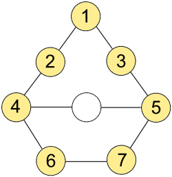

#Головоломка
На изображении ниже представлены 8 ячеек, одна из которых пустая, а остальные содержат цифры от 1 до 7.

Между соседними (соединенными линией) ячейками цифры можно перемещать при помощи свободной ячейки. Цель: расставить
цифры аналогично тому, как это изображено на исходном рисунке. Требуется написать программу на языке java, решающую
данную задачу за минимальное количество шагов. Код должен быть оформлен в виде класса, реализующего следующий
интерфейс:

    /**
    * Интерфейс решения головоломки
    */
    public interface ConundrumSolver {
    /**
    * Поиск минимального количества шагов для решения головоломки
    * @param initialState исходное состояние
    * @return решение
    */
      int[] resolve(int[] initialState);
    }
    
В качестве входного параметра, метод solve принимает массив initialState, содержащий цифры от 0 до 7 в произвольном порядке
(где 0 - свободная ячейка). Порядок чтения цифр в массиве: слева направо, сверху вниз. В качестве результата работы метода
ожидается получить последовательность шагов - массив, содержащий цифры [1,7], Очередность цифр в массиве указывает
порядок перемещения их в пустую ячейку. В случае наличия нескольких вариантов решения, допускается любой. Гарантируется
наличие решения задачи при любом варианте исходного расположения цифр.

####Пример 1

Ввод

    1 2 3 4 0 5 6 7
Вывод

    <пустой массив>
####Пример 2
Ввод

    2 1 3 4 0 5 6 7
Вывод

    5 3 2 1 2 3 5
####Пример 3
Ввод

    0 1 2 3 4 5 6 7
Вывод

    2 1 3 4 5 1 3 2 3 1 5 4 2 1 3 1 2 4
    
Проект